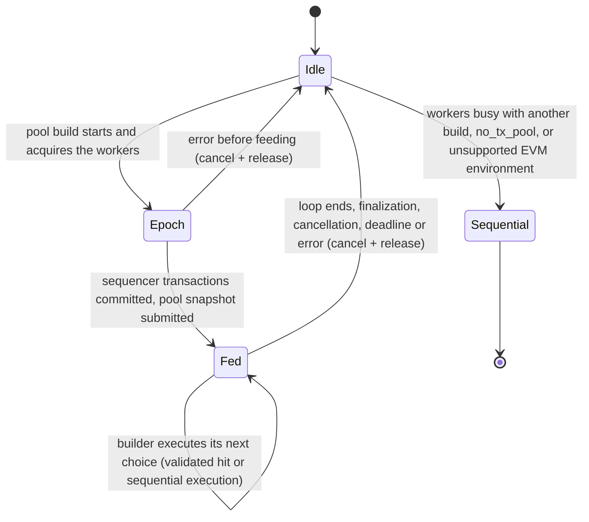

# Builder speculation contract

The basic builder alone selects and orders transactions. A speculator predicts work, never
admission. `take` has a configurable frontier wait budget (10 ms by default), waking on reset
or cancellation. This is a scheduling budget, not a hard real-time/provider-I/O deadline.
Unsupported transactions, panics and timeouts fall back to ordinary execution. The basic payload
builder is wired behind an off-by-default flag (see Phase 2 below). Engine invalidation is only a scheduling hint; owner validation is never skipped.

Each parent epoch fixes the EVM factory, environment and immutable parent database factory.
Workers own their providers. Reset/cancel prevents results from an earlier epoch escaping.
Authentic immutable parent account/storage reads are cached separately from committed writes;
take validates this cache without constructing a provider. Cache misses fail closed into repair,
which constructs an owner-local provider. The factory must also support that rare owner call.
Submit retains a matching ordered suffix and appends new candidates to its plan. Skips remove
speculative writes and invalidate readers; reordered plans start a new generation. A bounded
generation has max(1024, 4 × initial-window-length) indices and rolls over when full, retaining
the committed overlay but discarding advisory work. Live slots stay bounded by the submitted window.
Workers forward writes, invalidate affected readers and block on ESTIMATE dependencies.
The builder alone advances the committed prefix through on_commit, including inline execution,
fees and system changes. A returned result is only a proposal: a later choice without a commit
discards its writes. An unpredicted choice executes inline and preserves the remaining plan.
Store validation first repairs stale frontier work on the owner using an exact-prefix reader.
At most one subsequent failed owner-State validation is retried on a worker at the exact prefix;
a second failure or a wait timeout executes inline. Each take gets its own bounded wait budget.

Consumption on the owner thread checks transaction identity, environment, every account
existence/nonce/code read, every storage value, and every recorded balance range against
committed State. L1 fee parameter reads are recorded too. Only after validation do balances
rebase by committed minus observed, storage originals come from the committed prefix, and
fee credits enter the ordinary ResultAndState. Lifecycle flags remain those of execution.
The normal executor alone commits; rejected commit conditions never update the overlay.
Deposits, EIP-8130 and Amsterdam or later execution remain inline.
The first ordinary transaction also executes inline to initialize the owner's block-local L1
fee cache. A committed change to L1-block storage/lifecycle disables speculation for the rest
of that context, preserving the cache's sequential semantics. Canonical transaction environments
are compared in full, not just by envelope hash; custom environments take the inline path.

Use the same production EVM factory and uninspected environment on both sides. Code served by
hash must match its hash (candidate executions reject mismatches), and block hashes belong to
the immutable parent epoch. The current factory accepts the engine's infallible, Sync read
facade; integrating fallible providers needs an error-poisoning facade, not default-value reads
that could be mistaken for authentic state. Providers are constructed/used on their worker and
need not be Send. cancel is nonblocking; Drop joins in-flight work, so provider I/O must be bounded.
A worker releases its provider as soon as its epoch is cancelled or replaced, so no reader outlives
the build that installed it. A worker panic stops its generation and is logged at warn level.

Both execution modes share AtomicSchedule: per-position phases, invalidation counters, dependency
waits and compare/exchange claims. Builder plans have a fixed-capacity append-only slot array;
workers scan the lowest pending position and publish under that position's lock, never the owner
queue lock. Retiring a running slot prevents late publication without waiting for provider I/O.
Workers retain their base reader per epoch and reuse an EVM per generation. Panic/stop wakes waiters.

`take` checks recorded values against Store and repairs invalid frontier work on the owner.
It does NOT apply state: a builder commit-condition can still decline the proposal. Only
`on_commit` applies the owner's admitted, fee-rebased state and advances the frontier. A later
choice or submit removes a declined proposal's writes and invalidates readers without changing
Store; cancellation discards every uncommitted proposal. Mandatory owner-State validation remains
independent of this Store check. Unpredicted commits invalidate readers after a publication fence.
Feeder calls/take/on_commit belong to one owner; cancellation/reset may come from another thread.

Invalid-transaction outcomes retain their transaction error and every observation just like successful
executions. Builder workers do not assume the signed nonce is valid: nonce errors read the real
visible sender. Invalid outcomes publish no writes and defer no fees. Before reusing an error,
both Store and independent owner-State validation must pass; failed executions conservatively
require exact observed balances. A changed nonce, balance or fee parameter must retry, not skip
a transaction that is now valid. Unsupported/provider failures remain misses, never transaction
errors. Removing a write-free invalid slot must not invalidate unrelated readers.
Duplicate hashes in a submitted snapshot share one advisory slot at their first position;
resubmitting the same ordered unique candidates must retain completed work. Admission of repeated
choices still belongs to the owner, and a delivered/retired result cannot be consumed twice.

Owner validation still checks every observation: Store equivalence is not assumed. Cached Store
account checks borrow metadata under shard guards instead of cloning AccountInfo/bytecode.
Adjacent owner storage checks reuse the already-loaded account but still read every slot; the
lookup counter counts actual basic/storage calls. Rebasing loads account metadata only when it
will fetch non-created storage originals. Front-of-plan retirement pops instead of scanning K.

Tests must exercise stale nonce/storage rejection, admitted balance drift and fee rebasing,
identity mismatch, discarded work/reset, and a declined commit followed by another choice.
The offline gate compares the same deterministic fault stream's included hashes, full
receipts and BundleState against a sequential loop at every measured iteration.

## Phase 2: basic payload builder integration

`BasePayloadBuilder` (crate `base-execution-payload-builder`) owns one persistent `Speculator`
when `BaseBuilderConfig::speculation` is set. The builder binary sets it from
`--builder.speculative-workers N` (N > 0) in its basic-only and cutover modes; worker spawn failure
fails startup. The default is 0, which constructs no workers, installs nothing into the execution
context and leaves every builder code path identical to the sequential builder. The node's own
payload-builder component always builds sequentially.

Contract:

- **Authority.** The builder loop (`execute_best_transactions`) is unchanged and remains the sole
  selector: fair priority order, validity predicates, commit condition, admission/metering
  callbacks and DA/gas limits all run exactly as without speculation. Speculation only executes
  candidates ahead of the loop.
- **Epoch.** A build installs `SpeculationParent { parent hash, next-block EvmEnv, production
  BaseEvmFactory, provider factory }` before pre-execution changes, and installs the speculator
  into the block executor's context. Sequencer transactions commit through the executor and so
  update the overlay. Pre-block system-call writes (beacon root, block-hash history) are not
  forwarded; a prediction that read those slots fails validation and executes sequentially.
  Amsterdam (BAL) environments do not start an epoch. No BAL output is produced.
- **Feed.** After the sequencer transactions, the build takes an independent
  `best_transactions_with_attributes` snapshot of the pool with the same attributes as the
  builder's own iterator and submits up to `Prediction::MIN_CAPACITY` candidates in that order.
  Divergence between the snapshot and the builder's choices (parked/promoted validity candidates,
  skipped nonce lanes, newly arrived transactions) only causes misses.
- **Consumption.** For each choice the executor takes the matching prediction, compares identity
  and environment, and validates every observation against the builder's committed `State` before
  rebasing. Valid results (including validated transaction errors) feed the unchanged commit
  condition; anything else executes sequentially. A result the commit condition declines is never
  committed, and its speculative writes are retired on the next choice.
- **Providers.** Each worker constructs its own reader with
  `StateProviderFactory::state_by_block_hash(parent)` on its own thread; reth is unchanged. The
  reader is wrapped in an error-poisoning facade: a provider error is logged at warn level and
  aborts that worker's generation by unwinding (without invoking the panic hook). Every abort is
  contained by the speculator, so provider errors and worker panics become misses, never build
  failures.
- **Lifetime.** At most one build owns the workers at a time; a concurrent build runs sequentially.
  The owning build cancels the epoch when its pool loop ends or on any early return (finalization,
  payload cancellation, deadline, error). Cancellation is nonblocking: workers stop at their next
  check, drop their readers and park until the next epoch. Worker threads are joined when the
  builder is dropped.
- **Observability.** On release each session increments `base_builder_speculative_hits_total`
  (validated results consumed), `base_builder_speculative_misses_total` (pool transactions executed
  sequentially while speculating, including those after a rejection) and
  `base_builder_speculative_rejected_total` (results that failed consume-time validation), and logs
  the same counts at debug level.

Required tests: with speculation enabled and disabled, a pool containing a same-sender nonce chain,
cross-transaction storage and balance dependencies, a commit-condition rejection and an invalid
transaction produces identical transactions, receipts, gas, `BundleState` and hashed post-state;
cancellation and finalization release the workers for the next build; failing worker providers
fall back to the sequential payload.
